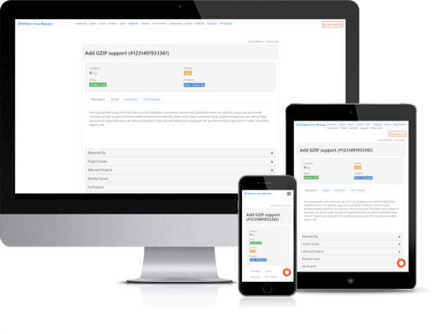

<!-- PROJECT LOGO -->
 

  

  <h3 align="center">Software Issue Manager</h3>

  

    Best project management and issue tracking plugin for WordPress. Get your development team to document, analyze, track and prioritize projects and issues easily.
     
     
     <a href="https://github.com/emarket-design/software-issue-manager/issues">Report Bug</a>
    ·
    <a href="https://github.com/emarket-design/software-issue-manager/issues">Request Feature</a>
     

<!-- ABOUT THE PROJECT -->
## About The Project

<ul>
<li>Consolidate information and communications leading to issue resolution.</li>
<li>Deliver quick and easy access to the information needed.</li>
<li>Role based content access for managers, employees, and clients.</li>
<li>Assign responsibility and monitor progress from start to finish.</li>
<li>Gain insight through built-in or custom reports.</li>
<li>Support public, private or mixed project development</li>
</ul>

### Related WordPress Plugins

* [WP Ticket Starter](https://wpticketcom.emdplugins.com/) Powerful customer support and helpdesk ticketing system.
* [Request a quote Starter](https://requestaquote.emdplugins.com/) The Best Sales Quoting software for WordPress.
* [WP Easy Contact Starter](https://wpeasycontactcom.emdplugins.com) Complete contact management solution to start, develop and grow your customer relationships.
* [Employee Directory Starter](https://employee-directory-com.emdplugins.com) The most complete employee directory software to power up your business.
* [Employee Spotlight Starter](https://espotlight-com.emdplugins.com) Everything you need to display and manage staff profiles.
* [Campus Directory Starter](https://campusdircom.emdplugins.com) The Best Campus Directory for Higher Education Institutions.

### Features

* [Allow access to your data from any device, any time.](https://emdplugins.com/?p=10487&pk_campaign=software-issue-manager-com&pk_kwd=github)
* [Create custom fields to expand your project, issue and member fields.](https://emdplugins.com/?p=10632&pk_campaign=software-issue-manager-com&pk_kwd=github) - Premium feature (included both Pro and Ent)
* [Powerful, easy to use customization from the plugin settings.](https://emdplugins.com/?p=10634&pk_campaign=software-issue-manager-com&pk_kwd=github) - Premium feature (included both Pro and Ent)
* [Create and display custom reports on your projects, issues and member groups.](https://emdplugins.com/?p=10636&pk_campaign=software-issue-manager-com&pk_kwd=github) - Premium feature (included both Pro and Ent)
* [Control access to issues, projects and member profiles.](https://emdplugins.com/?p=10500&pk_campaign=software-issue-manager-com&pk_kwd=github) - Premium feature
* [Customizable, powerful notification system to keep your project team posted.](https://emdplugins.com/?p=10499&pk_campaign=software-issue-manager-com&pk_kwd=github) - Premium feature
* [Workflow: Automate your project tasks on a schedule basis.](https://emdplugins.com/?p=12958&pk_campaign=software-issue-manager-com&pk_kwd=github) - Premium feature (Included in Ent only)
* [Summary views to find patterns and track them.](https://emdplugins.com/?p=10635&pk_campaign=software-issue-manager-com&pk_kwd=github) - Premium feature (included both Pro and Ent)
* [Powerful, realtime, custom metrics to measure performance and track patterns.](https://emdplugins.com/?p=10502&pk_campaign=software-issue-manager-com&pk_kwd=github) - Premium feature (Included in Ent only)
* [Implement projects with ease.](https://emdplugins.com/?p=10626&pk_campaign=software-issue-manager-com&pk_kwd=github) - Premium feature
* [Workflow: Automate your business rules when an issue, project or member record is created or updated.](https://emdplugins.com/?p=12957&pk_campaign=software-issue-manager-com&pk_kwd=github) - Premium feature (Included in Ent only)
* [Control who accesses what on a field by field basis.](https://emdplugins.com/?p=12960&pk_campaign=software-issue-manager-com&pk_kwd=github) - Premium feature (Included in Ent only)
* [Allow all project, issue and member fields to be updated from the frontend.](https://emdplugins.com/?p=12959&pk_campaign=software-issue-manager-com&pk_kwd=github) - Premium feature (Included in Ent only)
* [Powerful project issue tracking with intuitive interface.](https://emdplugins.com/?p=10627&pk_campaign=software-issue-manager-com&pk_kwd=github) - Premium feature
* [System wide dashboard to keep an eye on big picture.](https://emdplugins.com/?p=10498&pk_campaign=software-issue-manager-com&pk_kwd=github) - Premium feature
* [Give more power to project team members](https://emdplugins.com/?p=10976&pk_campaign=software-issue-manager-com&pk_kwd=github) - Premium feature (included both Pro and Ent)
* [Categorize projects, issues and members to form groups of interest.](https://emdplugins.com/?p=10630&pk_campaign=software-issue-manager-com&pk_kwd=github) - Premium feature
* [Find what is important and relevant faster on your projects and issues.](https://emdplugins.com/?p=10629&pk_campaign=software-issue-manager-com&pk_kwd=github) - Premium feature
* [Get insight on project member activities, interactions and performance.](https://emdplugins.com/?p=10637&pk_campaign=software-issue-manager-com&pk_kwd=github) - Premium feature
* [Powerful project, issue and member commenting system with file attachment support.](https://emdplugins.com/?p=10631&pk_campaign=software-issue-manager-com&pk_kwd=github) - Premium feature
* [Streamlined frontend forms to make it easy create and document issues, projects and members.](https://emdplugins.com/?p=10633&pk_campaign=software-issue-manager-com&pk_kwd=github) - Premium feature (included both Pro and Ent)
* [Easy to use sidebar widgets to showcase progress.](https://emdplugins.com/?p=10628&pk_campaign=software-issue-manager-com&pk_kwd=github) - Premium feature
* [Project and team member specific dashboards to measure performance and contributions.](https://emdplugins.com/?p=10501&pk_campaign=software-issue-manager-com&pk_kwd=github) - Premium feature (Included in Ent only)
* [Import, export and update project, issue and member information in bulk from or to CSV.](https://emdplugins.com/?p=10503&pk_campaign=software-issue-manager-com&pk_kwd=github) - Add-on (included both Pro and Ent)
* [Connect and track your Easy Digital Downloads products and services with the SIM issues, projects and project members.](https://emdplugins.com/?p=10506&pk_campaign=software-issue-manager-com&pk_kwd=github) - Add-on
* [Connect and track your WooCommerce products and services with the SIM issues, projects and project members.](https://emdplugins.com/?p=10507&pk_campaign=software-issue-manager-com&pk_kwd=github) - Add-on
* [Find and track information on your issues, projects and project members faster with smart search.](https://emdplugins.com/?p=10504&pk_campaign=software-issue-manager-com&pk_kwd=github) - Add-on (included both Pro and Ent)
* [Get your project, issue and member information in sync with Microsoft Active Directory/LDAP services.](https://emdplugins.com/?p=10508&pk_campaign=software-issue-manager-com&pk_kwd=github) - Add-on
* [Create and update project issues including comments from incoming email.](https://emdplugins.com/?p=10505&pk_campaign=software-issue-manager-com&pk_kwd=github) - Add-on (Included in Ent only)

<!-- GETTING STARTED -->
## Getting Started

To get a local copy up and running follow these simple example steps.

### Software Issue Manager WordPress Plugin Links

 * [Software Issue Manager Starter Demo Site](https://simcom.emdplugins.com/?pk_campaign=software-issue-manager-com&pk_kwd=readme)
* [Software Issue Manager Starter Documentation](https://docs.emdplugins.com/software-issue-manager-community/?pk_campaign=software-issue-manager-com&pk_kwd=readme)
* [Software Issue Manager Professional Demo Site](https://simpro.emdplugins.com/?pk_campaign=software-issue-manager-com&pk_kwd=readme)
* [Software Issue Manager Professional Documentation](https://docs.emdplugins.com/software-issue-manager-professional/?pk_campaign=software-issue-manager-com&pk_kwd=readme)
* [Software Issue Manager Professional Changes](https://emdplugins.com/articles/sim-pro-wordpress-plugin-changelog/?pk_campaign=software-issue-manager-com&pk_kwd=readme)
* [Software Issue Manager Enterprise Demo Site](https://siment.emdplugins.com/?pk_campaign=software-issue-manager-com&pk_kwd=readme)
* [Software Issue Manager Enterprise Documentation](https://docs.emdplugins.com/software-issue-manager-enterprise/?pk_campaign=software-issue-manager-com&pk_kwd=readme)
* [Software Issue Manager Enterprise Changes](https://emdplugins.com/articles/sim-ent-wordpress-plugin-changelog/?pk_campaign=software-issue-manager-com&pk_kwd=readme)

### Installation

#### Using This Page
* Click on Clone or Download button on this page. Click, and you can see a drop-down box having two options, click on Download ZIP.
* Login to your website and go to the Plugins section of your admin panel.
* Click the Add New button.
* Under Install Plugins, click the Upload link.
* Select the plugin zip file from your computer then click the Install Now button.
* You should see a message stating that the plugin was installed successfully.
* Click the Activate Plugin link.

#### Using WordPress

The simplest way to install is to click on WordPress 'Plugins' page then 'Add' and type 'Software Issue Manager' in the search field.

##### Manual Installation Type 1

* Login to your website and go to the Plugins section of your admin panel.
* Click the Add New button.
* Under Install Plugins, click the Upload link.
* Select the plugin zip file from your computer then click the Install Now button.
* You should see a message stating that the plugin was installed successfully.
* Click the Activate Plugin link.

##### Manual Installation Type 2

* You should have access to the server where WordPress is installed. If you don't, see your system administrator.
* Copy the plugin zip file up to your server and unzip it somewhere on the file system.
* Copy the "software-issue-manager" folder into the /wp-content/plugins directory of your WordPress installation.
* Login to your website and go to the Plugins section of your admin panel.
* Look for "Software Issue Manager" and click Activate.

<!-- CONTRIBUTING -->
## Contributing

Contributions are what make the open source community such an amazing place to learn, inspire, and create. Any contributions you make are **greatly appreciated**.

1. Fork the Project
2. Create your Feature Branch (`git checkout -b feature/AmazingFeature`)
3. Commit your Changes (`git commit -m 'Add some AmazingFeature'`)
4. Push to the Branch (`git push origin feature/AmazingFeature`)
5. Open a Pull Request

<!-- LICENSE -->
## License

Distributed under the GPLv2 or later License. See [`LICENSE`](https://www.gnu.org/licenses/gpl-2.0.html) for more information.

<!-- CONTACT -->
## MORE INFO

[Software Issue Manager](https://emdplugins.com/plugins/software-issue-manager-wordpress-plugin/) - WORDPRESS PLUGIN PAGE